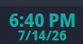
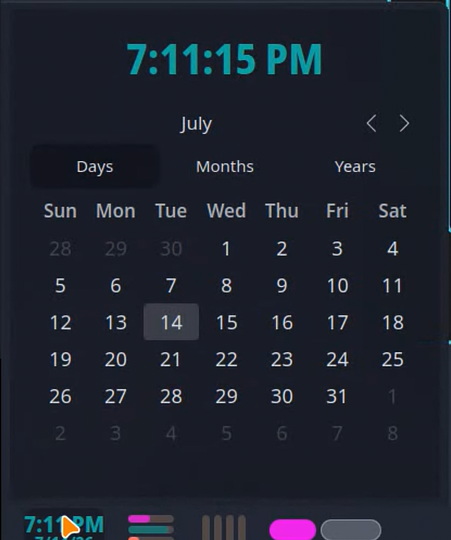

# Color Clock

A KDE Plasma panel widget that displays the current time and date with fully customisable fonts and colours.



 

## Features

- Large, readable time display
- Date shown underneath
- Custom font family, size, and colour for both time and date
- Adapts to horizontal and vertical panels
- Lightweight — no network requests

## Requirements

- KDE Plasma 6.0+

## Installation

```bash
cd ~/.local/share/plasma/plasmoids/
git clone https://github.com/PlasmaDrifter/color-clock local.widget.color-clock
```

Then right-click your panel → **Add Widgets** → search for **Color Clock**.

## Configuration

Right-click the widget → **Configure…**

| Option | Description |
|--------|-------------|
| Time font | Font family and size for the time display |
| Date font | Font family and size for the date display |
| Time colour | Colour of the time text |
| Date colour | Colour of the date text |

